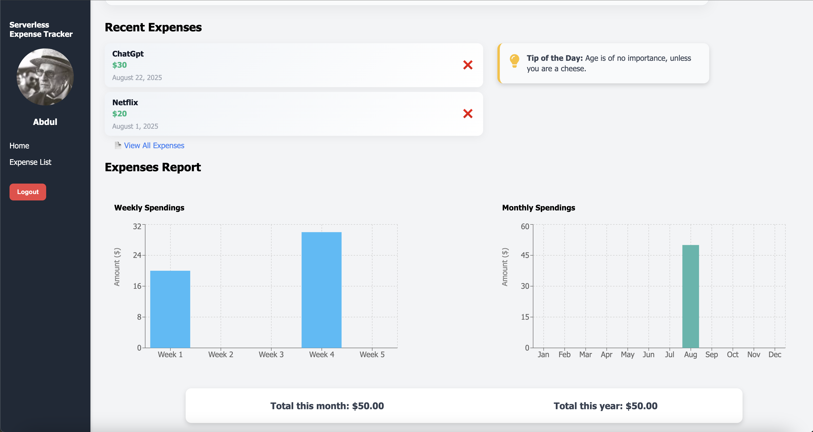

# 💰 Serverless Expense Tracker

A modern, full-stack expense tracking web app built with **React**, **Firebase Authentication**, and **AWS (Lambda, DynamoDB, API Gateway)**. Track your expenses, view weekly/monthly reports, and manage your budget in real time—all from a clean UI and a serverless backend.

## 📸 Screenshots

  

---

## 🚀 Live Demo  
🌐 (www.serverlesstracker.dev)

---

## ✨ Features

- 🔐 **User Authentication** with Firebase (sign up / login)
- 📊 **Add, view, and delete expenses** in real-time
- 📅 **Bar charts** for weekly and monthly spending
- ☁️ **Serverless backend** using AWS Lambda + API Gateway
- 💾 **Persistent data** storage in DynamoDB
- 🕒 **Auto logout after inactivity** for security
- 🌍 **Deployed on Vercel** with custom domain

---

## 🛠 Tech Stack

| Frontend         | Backend / Infra             |
|------------------|-----------------------------|
| React.js         | AWS Lambda                  |
| Firebase Auth    | AWS API Gateway             |
| Recharts (Charts)| AWS DynamoDB (NoSQL DB)     |
| CSS Flex/Grid    | Firebase SDK (client side)  |
| Vercel Hosting   | IAM (secure Lambda access)  |

---